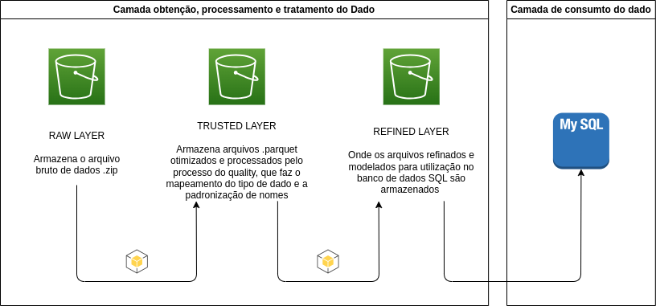

# 🧬 Protein Data Bank

Repositório contendo o projeto de um pequeno data lake com um conjunto de dados sobre proteínas, disponibilizados pelo https://www.rcsb.org/.

> Dados disponíveis em -> https://www.kaggle.com/datasets/shahir/protein-data-set

# Conteúdo:
1. Pipeline de extração, obtenção e disponibilização do dado para consumo
2. 

# Estrutura do projeto

- **app**: Contém as aplicações de consumo final do dado
- **data**: Pasta para armazenamento de arquivos de dados temporários processados
- **docs**: Documentações do projeto
- **explore**: Notebooks de exploração/experimentação
- **src**: Local com os recursos utilizados pelas aplicações
- **example.env**: Local com o exemplo do arquivo .env demonstrando como armazenar as credenciais utilizadas pelo projeto

# Arquitetura do pipeline de dados

- Utilização do AWS s3 para armazenar os arquivos pelas camadas
- Contrução em três níveis de granularidade do dado
- Banco SQL final para consumo do dado tratado

