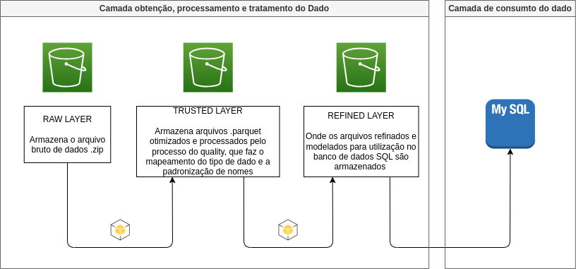

# 🧬 Protein Data Bank

Repositório contendo o projeto de um pequeno data lake com um conjunto de dados sobre proteínas, disponibilizados pelo https://www.rcsb.org/.

> Dados disponíveis em -> https://www.kaggle.com/datasets/shahir/protein-data-set

<div style="display: inline_block"><br>
     
  
  
  
  
  
   
  
   
</div>       


# Conteúdo:
1. Pipeline de extração, obtenção e disponibilização do dado para consumo
2. Modelo de classificação da estrutura com base em resultados de testes laboratoriais
3. API para consumo da previsão dos modelos
 
# Estrutura do projeto

- **app**: Contém a api de consumo final dos modelos
- **data**: Pasta para armazenamento dos arquivos de dados temporários durante o preocessamento
- **docs**: Documentações do projeto
- **src**: Local com os recursos utilizados pelas aplicações
- **example.env**: Local com o exemplo do arquivo .env demonstrando como armazenar as credenciais utilizadas pelo projeto


# Arquitetura do projeto

### Pipeline de dados
- Utilização do AWS s3 para armazenar os arquivos pelas camadas
- Contrução em três níveis de granularidade do dado
- Banco SQL final para consumo do dado tratado




 Banco relacional:


### Pipeline de Machine Learning
- Os dados são extraídos por python utilizando SQL
- Os dados são tratados como features para treinamento do modelo de Machine Learning
- O modelo é serializado e disponibilizado com uma camada de API
- A API é utilizada para alimentar uma ferramenta de visualização facilitando a utilização e experimentação das previsões


# API para consumo das previsões

A API foi desenvolvida utilizando o framework do FastAPI, pois é de fácil uso e agrega algumas funcionalidades de forma automática, como é o caso da documentação dos endpoints.

 Iniciando o serviço de API localmente da pasta raiz do proejto:
``` cmd:
fastapi dev api.py
```
☁️ Deploy da API foi feito utilizando plano free do [Render](https://render.com/)

> https://classificacao-proteinas.onrender.com/docs


# Comparativo entre input dos modelos

Como experimento, dois modelos com o mesmo target foram treinados, porém com inputs diferentes. 

A diferença entre os dois modelos em perfôrmance mostra como que a qualidade dos dados de input refletem na qualidade dos outputs previstos. Não existe "bala de prata" que resolva todos os problema possíveis de ML.

- lab_feature : O modelo recebeu como input os dados de testes e parâmetros físico químicos da macromolécula.
- sequence_feature: O modelo recebeu como input a sequência da macromolécula.

Resultados:


 Iniciando o painel de visualização localmente da pasta raiz do proejto:
``` cmd:
streamlit run dashboard.py
```
☁️ Deploy utilizando a própria infra disponibilizada pelo [Streamlit](https://share.streamlit.io/deploy)

> https://gustavocunhaa-classificacaoproteinas.streamlit.app